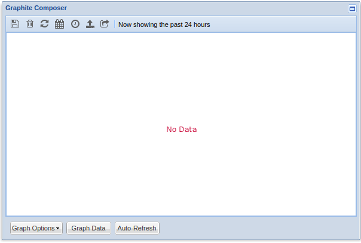
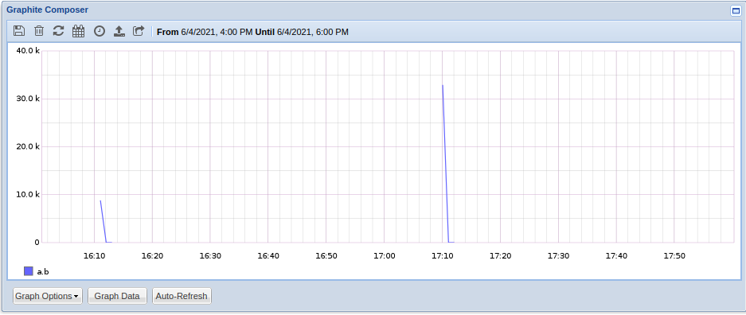
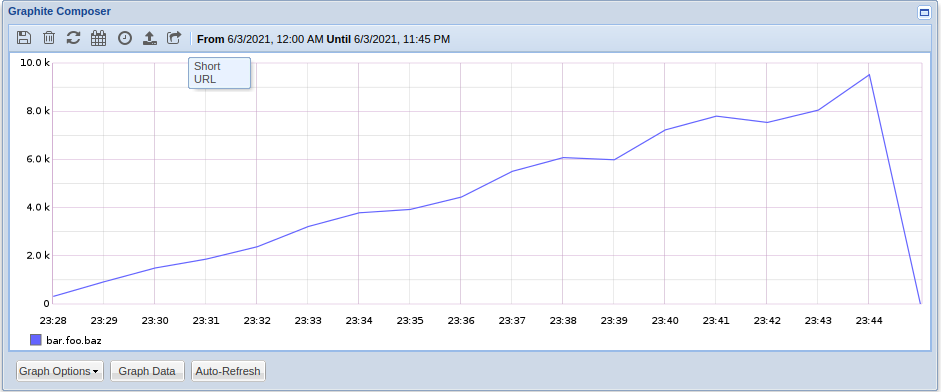
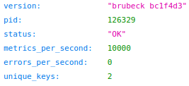

# Week 1: Exploration
### Brubeck, Graphite, & Statsd
* What is [Graphite](http://graphite.readthedocs.org/)
	* Graphite is a set of tools (carbon, whisper, and graphite webapp) which do 2 things:
		1. Store numeric time series data
		2. Render graphs of the data on demand
	* Graphite does not collect the data which is where Statsd and Brubeck come in.
* What is [Statsd](https://github.com/statsd/statsd)?
	* Statsd is a network daemon that runs on the [Node.js](http://nodejs.org) platform and listens for statistics, like counters and timers, sent over [UDP](http://en.wikipedia.org/wiki/User_Datagram_Protocol) or [TCP](http://en.wikipedia.org/wiki/Transmission_Control_Protocol) and sends aggregates to one or more pluggable backend services (e.g., [Graphite](http://graphite.readthedocs.org/)). It  
* What is [Brubeck](https://github.com/github/brubeck)?
	* Brubeck is a Statsd-compatible metrics aggregator written in C originally written by GitHub. It supports using either a [Graphite](http://graphite.readthedocs.org/) or [Kafka](https://kafka.apache.org/) pluggable  backend.
* Why Brubeck instead of Statsd?
	* Brubeck is not only much lighter weight than Statsd, but it also redesigned the architecture of the daemon. Statsd is a single-threaded even loop which listens on a single socket for metrics, and when receiving massive amounts of packets per second (upwards of 4 million) will waste CPU cycles because there will always be packets waiting to be read. Brubeck replaced this event loop with several worker threads sharing a single listen socket which affords much more efficiency when dealing with high packet input.

### Setting up Graphite
To set up a local instance of Graphite I followed this amazing blog post [here](https://luppeng.wordpress.com/2020/10/28/install-and-setup-graphite-on-ubuntu-server-20-04-via-apt-repository/).  After getting everything setup and running we can see the dashboard waiting for data.



### Setting up Statsd
To start with and get a basic understanding of the workflow and types supported by Statsd I started by setting up Statsd.
```bash
$ mkdir statsd && statsd
$ npm install statsd

# setup the config
$ cp node_modules/statsd/exampleConfig.js config.js
$ cat << EOF > config.js{
  graphitePort: 2023			/* graphite listening port */
, graphiteHost: "127.0.0.1"		/* graphite ip */
, port: 8125				/* statsd listening port */
, backends: [ "./backends/graphite" ]	/* configured backed */
, debug: true				
, dumpMessages: true			/* logs all incoming messages */
, flushInterval: 10000			/* send stats every 10s */
, servers: [				/* use udp */
    { 
        server: "./servers/udp",
        address: "0.0.0.0",
        port: 8125
    }]
}
EOF

# spin up the daemon
$ node ./node_modules/statsd/stats.js config.js 
```

Then to test that everything was connected and running, I sent some dummy data, and I'm not sure why but the times recorded are quite far off (ranging from a few hours to over a day):

```bash
# this sends a counter named a.b with an increment value of 1 
$ echo "a.b:1|c" | nc -u -w1 0.0.0.0 8125
```



### Setting up Brubeck

After I got Statsd up and running and got some dummy data sent in thru to the Graphite backend, it's time to get going with brubeck. GitHub no longer maintains the original repo, but there is a maintained fork [here](https://github.com/lukepalmer/brubeck). So, let's go ahead and get that instance all set up.

```bash
$ git clone https://github.com/lukepalmer/brubeck.git

# install dependencies
$ sudo apt install -y libjansson-dev libssl-dev libmicrohttpd-dev

# make brubeck
$ ./script/bootstrap
$ make test

# create the config
# config.default.json gets invoked by default
$ cp config.default.json.example config.default.json
$ cat << EOF > config.default.json
{
  "sharding" : false,			# only use one backend 
  "server_name" : "brubeck_debug",	# name used for internal metric reporting
  "dumpfile" : "./brubeck.dump",	# used to store metrics when triggering a dump
  "capacity" : 15,			# not mentioned in the documentation
  "http" : ":8080",			# port for internal stats api
  "backends" : [			# configure Graphite (carbon) backend
    {
      "type" : "carbon",
      "address" : "localhost",
      "port" : 2003,
      "frequency" : 10			# flush interval in seconds
    }
  ],
  "samplers" : [			# use statsd sampler
    {
      "type" : "statsd",		# uses UDP by default
      "address" : "0.0.0.0",
      "port" : 8126,			# brubeck listening port
      "workers" : 4,			# number of worker threads
      "multisock" : true,		# use the SO_REUSEPORT flag and 
					# bind each socket ot the same port
      "multimsg" : 8			# number of packets to read per recvmmsg call
    }
  ]
}
```

Now that we have brubeck setup, let's send it some dummy data to make sure it's connected to the Graphite backend properly.

```bash
# send 1000 counters named bar.foo.baz with the value of the iterator
# note that brubeck is listening on port 8126
$ for i in {1..1000}; do echo "bar.foo.baz:$i|c" | nc -u -w1 0.0.0.0 8126; done
```


### Testing Performance
Brubeck comes packaged up with a udp stress test to help get a sense of how many metrics per second it can handle. 

```bash
# build the udp-stress test
$ gcc -pthread -o udp-stress test-bin/udp-stress.c -lpthread

# run it on address 0.0.0.0:8126 to see a live number of metrics
# received per second
$ ./udp-stress 0.0.0.0 8126
1123035 metrics/s
```
On my machine, this test was able to handle between 1.1 and 1.2 million metrics per second which is a fair ways off of the touted 4 million per second. After running the stress test, I decided to hammer the real server with tons of packets. Originally I was using `nc` to send the packet which is a very slow way to send multiple packets, so I started sending them by redirecting directly to the port like `>/dev/udp/<hostname>/8126`.

```bash
# send 1000 packets using nc
# took ~17m27s
# ~1 metric/s
for i in {1..1000}; do echo "bar.foo.baz:$i|c" | nc -u -w1 0.0.0.0 8126; done 

# send 100,000 packets using the port directly
# took ~4s
# ~20,000 metrics/s
for i in {1..100000}; do echo "bar.foo.baz1:$i|c" >/dev/udp/<hostname>/8126; done
```
As you can see using `nc` is, for some reason, insanely slower (~20,000x). The metrics received per second by the brubeck instance can be seen by going to the the host address /ping. In my case that was `0.0.0.0:8080/ping`, and you can see some of the live information coming thru.



Then I tried to change the number of worker threads to see if there was some optimal range, and I did not see a difference aside from using a single thread. I even tried an absurd 256 which seemed to be catching the same number of metrics per second.

| Number of Worker Threads | Peak Metrics per Second |
| :---: | :---: |
| 1 | 8,483.4 |
| 2 | 10,000 |
| 3| 10,000 |
| 4 | 10,000 |
| 5 | 10,000 |
| 6 | 10,000 |
| 7 | 10,000 |
| 12 | 10,000 |
| 24 | 10,000 |
| 256 | 10,000 |

### Running Alongside Flux
I am currently trying to run an instance of brubeck alongside a flux broker. I am trying to spin it up in the `rc1` script which runs as the broker is being instantiated and loading all of the modules, but thru many iterations I am not able to have the brubeck instance run in the background. The broker runs the brubeck instance in the foreground which hangs the startup of the flux instance . This is the most recent attempt I tried at this:

```bash
if test $RANK -eq 0; then
     nohup ../brubeck/brubeck --config ../brubeck/config.default.json &
fi
```

This would also require that the brubeck instance be torn down alongside the broker, and a good place for this to happen would be inside of the `rc3` script which gets run as the instance is being destroyed. For now I am just blindly force killing an active brubeck instance, but if, for instance, multiple brubeck instances were running this would need to be changed.

```bash
kill -9 $(ps aux | grep [b]rubeck | awk '{print $2}')
```
