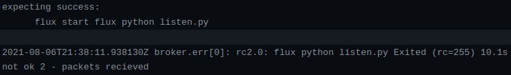

# Week 10: Summer SLAM and Implementation

### Summer SLAM

This past Tuesday I presented my project at the student Summer SLAM at LLNL, and it went well! The slides also went thru the open review and release process, so they've been added to the fripp repo [here](https://github.com/flux-framework/fripp/blob/main/summer_slam/FLUX_FRIPP_2021.pdf).

---

### Flux-core Stats API PR

After I presented at the Summer SLAM, I continued working on my open [pr](https://github.com/flux-framework/flux-core/pull/3806) to add the stats api to flux-core.

#### Changing Inc/Dec

The `flux_stats_inc/dec` functions were removed in favor of a single `flux_stats_gauge_inc` function to add a little bit more clarity that the increment is really tracking a gauge. Also the `flux_stats_gauge` function was renamed to `flux_stats_gauge_set` and removed the `inc` option from it.

___

#### Not Always Blindly Sending Metrics

As a way to show how the stats api worked, I added some collection within the broker's content-cache. The problem was that it was always firing off the timer watcher and collecting/sending metrics. So, I added a function to check if stats collection is enabled for the instance or for an individual metric.

```c
bool  fripp_enabled (struct  fripp_ctx  *ctx, const  char  *metric)
{
	if (ctx  &&  metric)
		return  zhashx_lookup (ctx->metrics, metric) !=  NULL;

	return  getenv ("FLUX_FRIPP_STATSD") !=  NULL;
}
```

---

#### Adding Metric Prefixes

Up until now, the user has had to specify the entire name of the metric when making a call to the stats api. For example in the content-cache the size call was:

```c
flux_stats_gauge_set (cache->h,
		      "flux.content-cache.size",
		      (int) zhashx_size (cache->entries));
```

Now there is a function to set a prefix which gets preprended to all metrics for a handle with the default of `flux.{{rank}}`. So the content-cache could make a call to `flux_stats_set_prefix` and set a prefix of say
`flux.{{rank}}.content-cache` and only pass the name of each member on each send.

```c
// cache_create
flux_stats_set_prefix (h, "flux.%d.content-cache", cache->rank);

// on send
flux_stats_gauge_set (cache->h,
		      "size",
		      (int) zhashx_size (cache->entries));
```

___

#### Adding CI Tests

One of the most important pieces of the pr, one that was missing before this week, is CI testing for the library. Designing tests for the stats api is not too simple since as of right now there is no command associated with it. It just runs if the `FLUX_FRIPP_STATSD` environment variable is set. So, my first iteration on a test was to use a tool called `socat` to set up a little listen server which exited upon receiving the first packet.

```bash
FLUX_FRIPP_STATSD=0.0.0.0:9999 flux start socat UDP-RECVFROM:9999 -
``` 

However, `socat` is not a standard tool, nor is it part of any of the docker images used in the CI. Instead I added a python script to manually set up a listen server which can be run under flux with a few options.

```python
import argparse
import re
import socket
import time
  
parser = argparse.ArgumentParser()
parser.add_argument("-s", "--search-for", metavar="METRIC",
		    help="search for a specific metric tag. Must be used along with the timeout arg")
parser.add_argument("-t", "--timeout", help="timeout in s", type=float, default=10.0)
parser.add_argument("-V", "--validate", help="validate packet form", action="store_true")
parser.add_argument("-w", "--wait-for", metavar="N",
		    help="wait for N packets to be recieved. Should be used along with the timeout arg",
		    type=int, default=1)
args = parser.parse_args()

s = socket.socket(socket.AF_INET, socket.SOCK_DGRAM)
s.bind(("0.0.0.0", 9999))
s.settimeout(args.timeout) 

start = time.time()
p = []

if args.search_for is not None:
	while time.time() - start < args.timeout:
		m = s.recvfrom(1024)[0]
		if args.search_for in m.decode("utf-8"):
			p.append(m)
			break
			
	if len(p) == 0:
		exit(-1)
		
else:
	for i in range(args.wait_for):
		try:
			p.append(s.recvfrom(1024)[0])
		except socket.timeout:
			exit(-1)

	if len(p) < args.wait_for:
		exit(-1)  

if (args.validate):
	# makes sure that the metrics are separated by '\n'
	# and have the form name.value|type
	# with the supported types being C, g, and ms
	metrics = str.splitlines("".join([_.decode("utf-8") for _ in p]))
	ex = re.compile("\w+:\d+\|ms|[gC]")
	
	for m in metrics:
		if not ex.search(m):
			exit(-1) 

else:
	print(p)
```

This script is failing most of the tests by the script exiting due to the timeout. 



It may be the case that simply increasing the timeout to account for the slowness of the CI environment will fix it, but I'll have to do some more testing.
