# Week 3: Exploration
### Finding the Appropriate Type for Flux Msgcounters

Last week I began testing on some "real" dummy data using the builtin message counters attached to each flux handle to get stats on each module. Originally I tried sending them as meters on accident as brubeck uses the `c` for meters while statsd uses it for counters, so then I did most testing sending the stats as gauges (`g`) which turned out to not be the most useful representation as the values were just increasing. This time around, I sent them as counters (`C`), and the resulting graphs are more useful as they show the change per flush interval; in other words, for each message type, the count that was received within the flush interval is what's sent along to Graphite. In addition to using a more useful metric type, I also used a different and possibly more practical watcher within the flux broker. I used a `flux_timer_watcher` with a `1s` wake up time to send the metrics once per second instead of being based on the blocking/unblocking/idling of the reactor loop. The timer callback function is identical to the one used within the check and idle watchers from last time. After the changes were made, it was time to test it out by running lots of simple jobs.

```bash
# enable fripp debugging on all modules
$ for m in $(flux module list | awk 'FNR !~ /^1$/ {print $1}'); do flux module debug -s 0x1000 $m; done

# run 10,000 simple jobs one at a time
$ for i in {1..10000}; do flux mini run echo -n "$i " && hostname; done
```

**took ~ 1h1m44s**

job-ingest message counters received per 10s flush interval

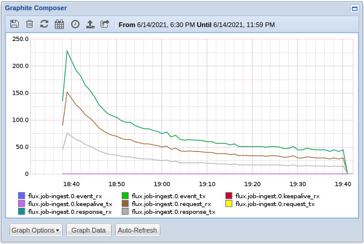

job-ingest total message counts

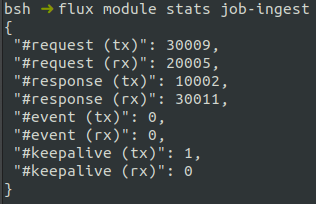

Brubeck total number of metrics (packets) received per 10s flush interval

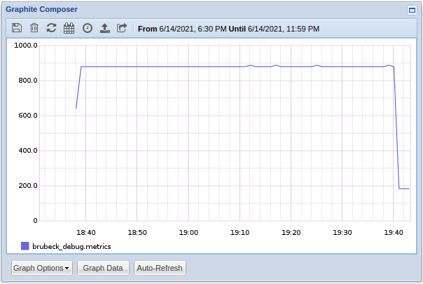

There is a noticeable decline in the number of messages received by the job-ingest module as the instance continues to run jobs which follows a roughly logarithmic pattern for all of the messages that are actually changing. To try and test this out I pulled a fresh instance, enable fripp debugging on all modules and then ran 10,000 jobs using the `src/test/throughput.py` script to test the throughput; running 10,000 jobs with a 1ms runtime took only about 5m23s which is about 9% as long as running 10,000 (`echo "$i " && hostname`) jobs earlier with about a 50ms run time.

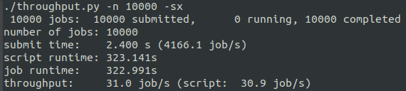

---

### Automating Testing

I was curious about the growth patterns of job runtime over time and how/if it was related to the growth of the content backing file, so I created a small test script to create a csv with the run number, the time for a number of jobs to run, and the the size of the content backing file. 

```bash
#!/bin/bash

if [ $# -ne 3 ]; then
    echo "./timer-csv.sh tests batch-size output"
    exit -1
fi


tot=$1
batch=$2
out=$3

rm -f $out

c=1
sq=$(flux getattr rundir)

echo "run #,time (s),content-sqlite size (b)" >> $out

# run $tot number of tests
while [[ $c -le $tot ]]; do
    sts=$SECONDS

    # run $batch number of jobs one by one
    for (( i=1; i<=$batch; i++ )); do 
        flux mini run echo -n "$i: " >/dev/null && hostname >/dev/null; 
    done

    ts=$((SECONDS - sts))
    echo "$c,$ts,$(ls -s $sq | awk '/^[0-9].*/ {print $1}')" >> $out 

    c=$((c + 1))
done
```

I ran this script to run 10,000 jobs in batches of 100 at a time like:

```bash
./timer-csv.sh 100 100 out-100-100.csv
```

First, I ran this without sending and message counters, and it took about 1h2m10s. Next, I ran it again in a new instance but with the 1s timer watcher sending the message counters to brubeck and it took about 1h2m19s. Lastly, I ran it again in the same instance I ran the previous test in. and it took about 2h54m2s. From within a fresh flux instance, there was not much of a difference between sending and not sending the metrics with only about a 9s difference overall, and a 0-1s difference per batch.

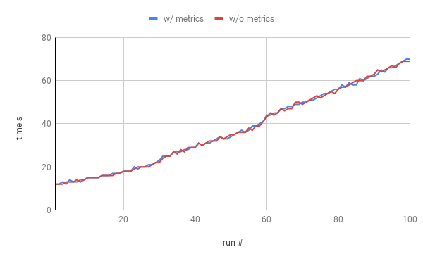

However, when running 10,000 additional jobs on an instance that just ran 10,000 jobs serially, there was a huge slowdown. The job time for the lifetime of the script followed basically the same small linear increase.

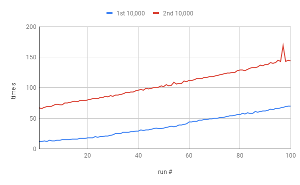

After seeing the large increase, I wanted to see if the completion times would just continue to grow, so I launched a larger job set of 250 iterations of 100 jobs (25,000 jobs) and it took about 4h51m2s. The total completion time for each loop of jobs (the sum of each individual batch of jobs) took 17462s which is roughly 4h51m, so most of the time seems to be spent running the jobs.

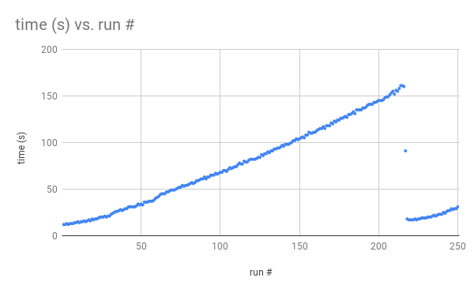

One interesting thing to note is that after the the peak time for 100 jobs of 162s after the 216th iteration, the time jumps down massively to only 18s on the 218th iteration which is only slightly slower than the starting time of 12s. The size of the content-sqlite file seemed to grow exponentially for about the first 217 iterations (21,700 jobs), then started to level off, and it apparently has a great fit of an 8th degree polynomial. I think gathering some metrics from within the content-cache could help explain the increase in job completion time and the sudden drop in time as well.

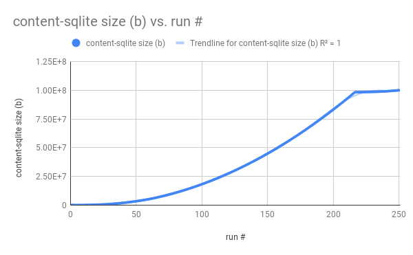

---

### Grouping Data

So far, I had been sending the message counters for each module as separate metrics to brubeck; there were a few things that would still be useful to see like: seeing the total number of messages sent per module per rank, and a way to see the total number of messages for a module regardless of rank.

#### Getting Total Messages Module
Getting total message per module can be done in two ways. It can be done within the flux broker itself and sent as a new packet to the server before closing the socket.

```c
len  =  sprintf (packet, "flux.%d.%s-tot:%d|C",
	rank, mod_name,
	ctx->last_mcs.request_tx  +  ctx->last_mcs.request_rx  +
	ctx->last_mcs.response_tx  +  ctx->last_mcs.response_rx  +
	ctx->last_mcs.event_tx  +  ctx->last_mcs.event_rx  +
	ctx->last_mcs.keepalive_tx  +  ctx->last_mcs.keepalive_rx);

if (sendto (sock, packet, len, 0, (void  *) &ctx->si_server, sock_len) <  0)
	flux_log (ctx->h, LOG_ALERT, "packet %s dropped", packet);
```

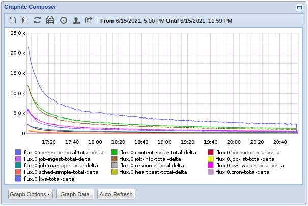

 Or it can be done within Graphite by summing all of the data from the individual message counter series.

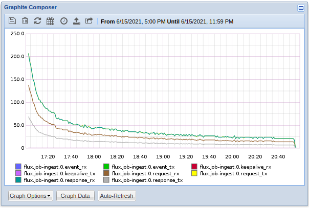

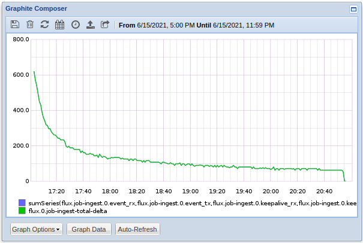

#### Combining Per-Rank Message Counters

To combine the message counters from each rank and see the total number of messages sent from a certain module in the entire instance can also be done using the `sumSeries` method withing Graphite. Say you had an instance with 4 brokers running and you wanted to send and check the kvs metrics. 

```bash
# start an instance with 4 brokers
$ flux start -s4

# enable the fripp debugging for the kvs
$ flux exec flux module debug -s 0x1000 kvs
```

The total number of messages per rank (ranks 1, 2, and 3 are all on top of each other)

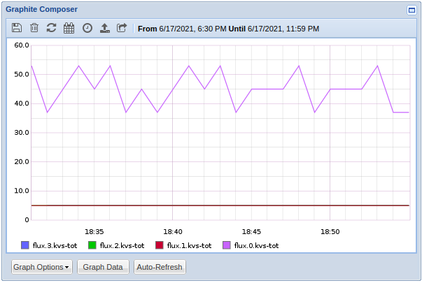

The total number of kvs messages for the instance

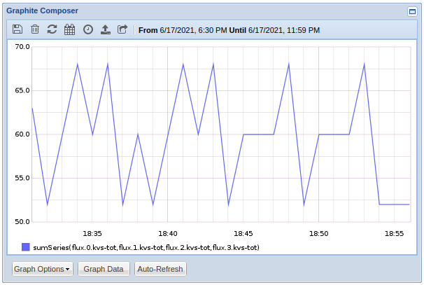

### Leveraging Statsd/Brubeck Metric Types
The statsd supported types are documented on their [GitHub](https://github.com/statsd/statsd/blob/master/docs/metric_types.md) repo, and [here](https://sysdig.com/blog/monitoring-statsd-metrics/) is a nice summary blog post about them as well.
* Counters 
	* A simple counter that sends the current count and the rate at each flush
	* `cnt:1|c or cnt:1|C` (statsd - c and brubeck - C) - add `1` to the `cnt` bucket
	* If a value of `1` is sent once each interval, the graph would be a straight line of `y=1`
	* Supported by both statsd and brubeck
	* Possible uses within flux:
		* Builtin message counters for each module 
		* Inactive job-list module stats
		* KVS namespace operations
* Gauges
	* Takes an arbitrary value at a point in time and maintains that value until next set
	* `val:100|g` - sets the value of `val` to `100`
	* `val:-10|g` - subtract `10` from the last value received for `val` (can also be done with addition)
	* If a value of `100` is sent once each interval, the graph would be a straight line of `y=100`
	* Supported by both statsd and brubeck
	* Possible uses within flux:
		* Pending and running job-list module stats
		* Information about the content cache
* Timers
	* Takes an amount of time (in milliseconds) for a given task, and statsd/brubeck will figure out percentiles, average (mean), standard deviation, sum, lower and upper bounds for the flush interval
	* `event:100|ms` - `event` took `100ms` to complete this time
	* Data sent will contain the keys:
		* count
		* count_ps
		* max
		* mean
		* median
		* min
		* sum
		* and percentiles (configurable)
	* Supported by both statsd and brubeck
	* Possible uses within flux:
		* Job completion time
		* KVS read/write times
* Histograms
	* Very similar to the timers but in addition bounds can be set
	* brubeck - `event:100|h` 
	* statsd - `event:100|ms` 
		* requires setup in the config file
* Meters
	* supported by only brubeck and ~~not documented anywhere~~
		* A depricated statsd type that is similar to a counter and also calculates the mean server side
	* `cnt:1|c`
	* based on some testing this type seems to be similar to gauges
* Sets
	* supported by only statsd
	* Counts the unique occurrences of events between flushes, and stores all of them in a set
	* A unique occurrence is when the counter is sent with a unique value
	* `uniques:765|s\nuniques:123|s\nuniques:765|s` - will make a set containing `123` and `765`
