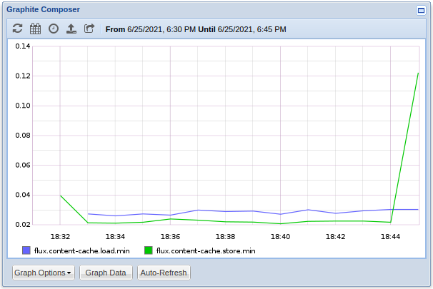

# Week 4: Exploration/Prototyping

### Consolidating Reusable Code

For the past couple of weeks, I had been setting up all of the needed components to send the metrics from within `modservice.c`, but it's time to pull out some of that reusable code into a new file. For ease of use, I decided (for now) to create a `fripp.c/h` pair of files within `src/broker` so there wouldn't be much needed to get it built and linked. After some changes, here's where the code stands now with only a few public facing functions. Two to create and destroy the `fripp_ctx` and one to format and send a string and some args.

```c
#ifndef  _BROKER_FRIPP_H
#define  _BROKER_FRIPP_H

#include  <stdarg.h>

struct  fripp_ctx;

struct  fripp_ctx  *fripp_ctx_create (flux_t  *h, const  char  *hostname, int  port);
void  fripp_ctx_destroy (struct  fripp_ctx  *ctx);

char  *fripp_format_send (struct  fripp_ctx  *ctx, const  char  *fmt, ...);

#endif
```

The `fripp.c` file has some helper functions to actually send the data, and in the case that a user compiles a packet string that is longer than the maximum size, a function to "split" the packet and send it as multiple packets. I say "split" in quotes because it doesn't actually get split (nor does it need to), but rather a null terminator replaces one of the newlines.

```c
#include <flux/core.h>
#include <unistd.h>
#include <stdbool.h>
#include <arpa/inet.h>
#include <netinet/in.h>
#include <sys/socket.h>

#define FRIPP_MAX_PACKET_LEN 1440
#define FRIPP_INTERNAL_BUF_SIZE (FRIPP_MAX_PACKET_LEN * 5)

struct fripp_ctx {
    flux_t *h;
    struct sockaddr_in si_server;
};

/* Bind a socket address to hostname:port.
 */
int fripp_bind_server (struct fripp_ctx *ctx, const char *hostname, uint16_t port)
{
    memset (&ctx->si_server, 0, sizeof (ctx->si_server));
    ctx->si_server.sin_family = AF_INET;
    ctx->si_server.sin_port = htons (port);

    if (!inet_aton (hostname, &ctx->si_server.sin_addr)) {
        flux_log_error (ctx->h, "error creating server address");
        return -1;
    }

    return 0;
}

/* Split a packet that is longer than FRIPP_MAX_PACKET_LEN
 * by the last '\n' character, and replace it with a '\0'.
 */
static int split_packet (char *packet)
{
    for (int i = FRIPP_MAX_PACKET_LEN - 1; i >= 0; i--) {
        if (packet[i] == '\n' || packet[i] == '\0') {
            packet[i] = '\0';
            return i;
        }
    }

    return -1;
}


/* Send the 'packet' string in one or more udp packets to
 * the bound server within 'ctx'.
 */
static int fripp_send_metrics (struct fripp_ctx *ctx, char *packet)
{
    int sock, sock_len = sizeof (ctx->si_server);

    if ((sock = socket(AF_INET, SOCK_DGRAM, 0)) == -1)
        return -1;

    int len = strlen (packet);
    bool split = false;

    if (len > FRIPP_MAX_PACKET_LEN) {
        split = true;

        if ((len = split_packet (packet)) == -1) {
            close (sock);
            return -1;
        }
    }

    if (sendto (sock, packet, len, 0, (void *) &ctx->si_server, sock_len) < 0)
        flux_log (ctx->h, LOG_ALERT, "packet %s dropped", packet);

    close (sock);

    if (split)
        return fripp_send_metrics (ctx, &packet[len + 1]);

    return 0;
}

void fripp_format_send (struct fripp_ctx *ctx, const char *fmt, ...)
{
    char *packet;
    char buf[FRIPP_INTERNAL_BUF_SIZE];

    va_list ap;
    va_start (ap, fmt);

    if (vasprintf (&packet, fmt, ap) < 0) {
        (void) vsnprintf (buf, sizeof (buf), fmt, ap);
        packet = buf;
    }

    fripp_send_metrics (ctx, packet);
    va_end (ap);

    if (packet != buf)
        free (packet);
}

void fripp_ctx_destroy (struct fripp_ctx *ctx)
{
    free (ctx);
}

struct fripp_ctx *fripp_ctx_create (flux_t *h, const char *hostname, int port)
{
    struct fripp_ctx *ctx;

    if (!(ctx = malloc (sizeof (*ctx)))) {
        flux_log_error (h, "fripp_ctx_create");
        return NULL;
    }
    if (fripp_bind_server (ctx, hostname, (uint16_t) port)) {
        flux_log_error (h, "fripp_bind_server");
        free (ctx);
        ctx = NULL;
    }

    return ctx;
}
```

The `fripp_ctx` struct is fairly empty now, but going forward I was thinking it might make sense to have another string member that can be the prefix used for metrics. Also, the format send requires the caller to know how the packet should be formed, and that's not as useful as it could be, so going forward it will probably change and allow for the user to just call it in a manner where they only pass a name, a metric, and a type instead.

After getting the reusable code setup I tested to make sure it was working by replacing the old code in `modservice.c` which basically just removed the manual binding of the server and sending; the sending of the message counters was replaced by this call to `fripp_format_send` within the 1s timer watcher callback.

```c
fripp_format_send (ctx->fripp, "flux.%s.%d.request_tx:%d|C\nflux.%s.%d.request_rx:%d|C\n\
flux.%s.%d.response_tx:%d|C\nflux.%s.%d.response_rx:%d|C\n\
flux.%s.%d.event_tx:%d|C\nflux.%s.%d.event_rx:%d|C\n\
flux.%s.%d.keepalive_tx:%d|C\nflux.%s.%d.keepalive_rx:%d|C",
	mod_name, rank, ctx->last_mcs.request_tx,
	mod_name, rank, ctx->last_mcs.request_rx,
	mod_name, rank, ctx->last_mcs.response_tx,
	mod_name, rank, ctx->last_mcs.response_rx,
	mod_name, rank, ctx->last_mcs.event_tx,
	mod_name, rank, ctx->last_mcs.event_rx,
	mod_name, rank, ctx->last_mcs.keepalive_tx,
	mod_name, rank, ctx->last_mcs.keepalive_rx);
```

---

### Collecting Data from the Content Cache

After setting up some of the reusable code outside of the module service, it was time to start gathering and visualizing some more useful data than the message counters.  The next place I started to gather metrics was from within the content cache which sits in front of the content backing module. What metrics are there within the content cache that can be of use? Let's take a look at the overloaded stats given for the content module.

```bash
$ flux module stats content
{
 "count": 0,
 "valid": 0,
 "dirty": 0,
 "size": 0,
 "flush-batch-count": 0
}
```

In addition to tracking the size of the cache, another useful metric would be to time how long the asynchronous calls (load and store) take to complete. First, I setup the stats to be sent. Similar to how I setup modservice to send the message counters, I added a timer watcher to wake up every second and send the metrics using the `content-cache`'s attached `fripp_ctx`. 

```c
static  void  timer_cb (flux_reactor_t  *r, flux_watcher_t  *w, int  revents, void  *arg)
{
	struct  content_cache  *cache  =  arg;
	uint32_t  rank;

	if (flux_get_rank (cache->h, &rank) <  0)
		flux_log_error (cache->h, "flux_get_rank");
 
	fripp_format_send (cache->fripp,
		"flux.content-cache.%d.count:%d|g\n\
flux.content-cache.%d.valid:%d|g\n\
flux.content-cache.%d.dirty:%d|g\n\
flux.content-cache.%d.size:%d|g\n\
flux.content-cache.%d.flush-batch-count:%d|g",
		rank, (int) zhashx_size (cache->entries),
		rank, cache->acct_valid,
		rank, cache->acct_dirty,
		rank, cache->acct_size,
		rank, cache->flush_batch_count);
}
```

There's not much different here from the message counters, but it is worth noting that all of the stats are being sent as gauges `g` and not counters `C`. I did some testing using both types for each stat, and they all produced similar results, but I think it makes more sense to have the m sent as snapshots of what the value is at each iteration as opposed to the change since the previous iteration.

**Dirty Entries and Flush Batch Count**


**Count and Valid Entries**


**Cache Size**


After I got the code to send the stats setup within the content cache, I tested it by running 25,000 jobs using the `src/throughput.py`.

**Cache Stats**


As you can tell, the size of the cache is much much larger than all of the rest of the stats as it's multiple megabytes being sent in bytes, so let's take a look at the other stats individually to see how we want to scale it.

**Count and Valid Entries**


The count and number of valid entries in the cache are in the hundreds of thousands, so let's start by scaling down the cache size by 100x (1/100).

**Count and Valid Entries and Size * (1/100)**


**Dirty Entries and Flush Batch Count**


The flush batch count and number of dirty entries are both in the 10's, so let scale the count and valid entries down by 1,000x and the size by 100,000x.

**Stats Scaled down**


Looking back it would probably make more sense to scale the size down by 1024 ^ 2 to get it into megabytes from bytes.

---

#### Timing Asynchronous Calls

Since load and store requests to the cache can be asynchronous, I wanted to track the time it took for each of the calls to complete. Within the content cache, I started a timer at the beginning of each load and store request, stored it in the flux aux storage, and clocked and sent the delta time once each load/store request was completed.

```c
static  int  cache_store (struct  content_cache  *cache, struct  cache_entry  *e)
{
	struct  timespec  *t0;
	if (!(t0  =  malloc (sizeof (*t0)))) {
		flux_log (cache->h, LOG_ALERT, "fripp time start");
	} else {
		monotime (t0);
		flux_aux_set (cache->h, "fripp::cc-store", t0, free);
	}
	
	...
}

static  void  cache_store_continuation (flux_future_t  *f, void  *arg)
{
	...
	struct  timespec  *t;
	if (!(t  =  flux_aux_get (cache->h, "fripp::cc-store"))) {
		flux_log (cache->h, LOG_ALERT, "flux_aux_get fripp::cc-store");
		errno  =  ENOMEM;
		goto  error;
	}

	fripp_format_send (cache->fripp, "flux.content-cache.store:%lf|ms", monotime_since (*t));
	...
}
```

The only difference between the load and store code was the naming, so instead of `flux.content-cache.store`, the loads were named `flux.content-cache.load`, and instead of `fripp::cc-store` the loads were stored as `fripp::cc-load`. Each of these `timespecs` is being sent as a timer type `ms` (a double of milliseconds), and on the backend, brubeck was figuring out percentiles, mean, median, min, max, sum, total count, and count/second. After I got this setup, I tested it by running 10,000 jobs using `throughput.py` twice in a row. 

**Load Percentiles**


**Store Percentiles**


**Load/Store Mean/Median**


**Load/Store Count/Sec**


**Load/Store Max**


**Load/Store Min**



**Load/Store Count and Sum**


After looking at the data, I was surprised at just how many more store operations the cache had than load operations when running lots of jobs, and It also looks like the stores were on average faster than the load, but the stores were also more volatile; store operations almost always had a shorter minimum time and a larger maximum time. Both loads and stores do have most of their requests within as small window of <5ms.
