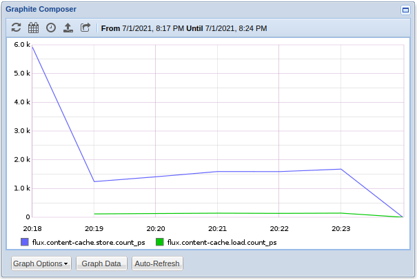

# Week 5: Prototyping and Jobtap 

### Refactoring Fripp Code

Since last week, I made some small changes to the implementation in `fripp.c`. First, I added the socket and the packet buffer to the `fripp_ctx`.

```c
struct fripp_ctx {
	flux_t *h;
	struct sockaddr_in si_server;
	int sock;
	char *buf;
	int buf_len;
};
```

In turn, that means that the socket is now opened only once per context (when it's being created in `fripp_ctx_create`) and closed once upon destruction of the context, and there is no longer a fixed-size internal buffer for each send (`fripp_format_send`). Instead the buffer in the context is dynamically sized and resized if needed with the idea that most packets being sent will be the same length for a while. One last notable change is that within `fripp_format_send` there is now a second `va_list` (a copy) that's used when the buffer needs to be resized. This was because sometimes, and I'm not sure why it didn't happen every time, upon resizing the buffer the second `vsnprintf` would segfault.

### Timing Asynchronous Load/Stores from the Content Cache

Last week I began collecting some metrics from the content-cache including timing the asynchronous load/store operations from the content cache. However, I stored the timespec for each load/store in auxiliary storage on the flux handle

```c
struct  timespec  *t0;
if (!(t0  =  malloc (sizeof (*t0)))) {
	flux_log (cache->h, LOG_ALERT, "fripp time start");
} else {
	monotime (t0);
	flux_aux_set (cache->h, "fripp::cc-store", t0, free);
}
```

That turned out to be the wrong approach as each load/store could (or more likely would) be overwriting the previously stored starting time since they are all the same name on the single flux handle. So, the timing metrics I showed last week probably don't mean much. To really time the load/store operations, I instead added a timespec to each `cache_entry`, and within the `cache_load` and `cache_store` callbacks set the start time at the beginning of the call using:

```c
monotime (&e->fripp_timestamp)
```

and then got and sent the final time within the `cache_load_continuation` and `cache_store_continuation` callbacks like:

```c
fripp_format_send (cache->fripp, "flux.content-cache.store:%lf|ms",
		   monotime_since (e->fripp_timestamp));
```

> the y-azis for these graphs is in ms

**Load Percentiles**


**Store Percentiles**


**Load/Store Mean/Median**


**Load/Store Count/Sec**



**Load/Store Max**


**Load/Store Min**


A majority of both load and stores were getting completed within 1s, but both did have some large times that pulled up the average for both to >= 2s. The stores tended to be faster, but there were also at least 100x more stores than loads, so there each large load affects the average much more.

### Counting Job States

One interesting place to gather some metrics is from within the job-manager which keeps track of jobs. I set about seeing how to best see how many jobs are in each state at any given time, and also to see how the workload and the cache affected each other. First things first was to get a count of the number of jobs in each state, and the best way to do this is to write a jobtap plugin which hooks into the job-manager module and can be notified upon state transitions. It has a `state_cb` that is invoked upon a `job.state.*` topic which means any job state transition will trigger this callback, and from there its gets the current and previous states for the job and increments the counts both. It also has a timer watcher which is invoked every 1s to send the metrics as gauges using the `fripp_ctx` in the arg. The gauges send a snapshot at the time of whatever the current count of each job state is, so I figured that'd be the best starting point.

```c
struct  state_counts {
	int  new;
	int  depend;
	int  priority;
	int  sched;
	int  run;
	int  cleanup;
	int  inactive;

	struct  fripp_ctx  *fripp;
	flux_watcher_t  *w;
	flux_plugin_t  *p;
};
```

For right now both callbacks take this struct, but it may be a bit cleaner to split this into two structs one for the counts and one for the flux stuff and have the flux container struct have a reference to a counts struct and have each callback take a different argument. The current code can be found here: [state-counts.c jobtap plugin](../code/jobtap-plugins/state-counts.c). This plugin is then compiled to a shared object using a local copy of the `fripp.c/h`. With my setup of `fripp.c/h` in the parent dir of the plugin and `flux-core` in my home directory a build line looks like:

```bash
$ gcc -shared -I$HOME/flux-core -I$HOME/flux-core/src/include -fPIC \
  -o state-counts.so ../fripp.h ../fripp.c state-counts.c
```

Then from `flux-core` in a running instance, the plugin can be loaded (assuming it's in `../fripp/code/jobtap-plugins/`) by:

```bash
$ flux jobtap load $(pwd)/../fripp/code/jobtap-plugins/state-counts.so
```

After loading the plugin I ran 10,000 jobs using the throughput test in a single node instance.

**Sched vs Inactive**


**Cleanup vs Run**


**Priority vs Depend**


**New**


The `sched` and `inactive` states have exact opposite trends which makes sense. In the beginning there should be 10,000 jobs scheduled and 0 inactive, and gradually the scheduled jobs should get run and cleaned up resulting in 10,000 inactive and 0 left scheduled. The `run` and `cleanup` states also seemed to have opposite trends, and it makes sense that if lots of jobs are running that not many jobs would be being cleaned up. Near the end there is a large spike in cleanups (and respective dip in running jobs) which is quite interesting. `Priority` and `depend` are two states that in this test, and every subsequent one, were always 0. If i print the states from within the plugin's `state_cb`, on a single job it produces the following output:

```bash
$ ./src/test/throughput.py -n1 -x
state=DEPEND prev_state=NEW
state=PRIORITY prev_state=DEPEND
state=SCHED prev_state=PRIORITY
state=RUN prev_state=SCHED
state=CLEANUP prev_state=RUN
state=INACTIVE prev_state=CLEANUP
```

And it's clear to see that the job does go thru both the `priority` and `depend` states. My assumption is that the resolution on some combination of the sending of the metrics and aggregating the metrics is not fine enough to mark these transitions as they are very quick. Lastly, why is the new state is getting to around -3.7 million?? Well that is because of two things. First the reason it's so large is because of the way that gauges in brubeck/statsd function. They take and arbitrary *positive* value or a signed value to increment the previous value. The reason that's affecting us is because of the topic string that the `state_cb` was registered under. `job.state.*` will never enter with a current state of `new`, so each time a new job is introduced the plugin catches it on the way out of the `new` state causing the count to be -10,000. Putting those two pieces together, every second when counts are being sent, the `flux.job-states.new` tag is being decremented by 10,000 instead of being set to -10,000. To handle this, I registered the same `state_cb` under the `job.new` topic string which will catch the jobs on the way in and *hopefully* keep the number non-negative.

### Adjusting the Resolution of metrics

One problem with the current stack is timing. I had setup the timer watcher in the plugin to send metrics once per second, then brubeck was aggregating and sending metrics over a 10s interval, and on the backend graphite *seemed* to be aggregating and plotting data once per minute or so. Given that some of the job states happen way faster than 1s or 10s or 1m, I tried to see if I could tweak some of the intervals to see a more finite resolution of each state and hopefully a more accurate picture of what was going on without impacting performance too much. One thing to note is going forward I started using flux instances of size 8 to see how that would affect the performance. The first thing I did was try adjusting the frequency at which the timer watcher was called to 0.1s and then 0.025s and running 20,000 jobs under each in two batches of 10,000. The 0.1s timer watcher ran first from 20:13-20:17 and the 0.025s watcher ran second from 20:18-20:21.

**Inactive vs Sched**


**Cleanup vs Run**


The shorter interval for the watcher had a very minimal performance affect on the jobs themselves, and it did seem to give a little bit more precision wrt to the `sched` and `inactive` states since they are closer to the true starting numbers of 0 and 10,000. It's also interesting to note that this was run on an instance of size 8 so with my 12 core CPU the instance had access to 96 virtual cores, but it never got more than 70 cores at use at once (at least that was reported). It was using on average only about half of the available cores at a time. Then I decided to pick 0.1s as the interval for the timer watcher due mostly to the type being used for the metrics since each time it's called the previous value is just overwritten in the aggregator anyways. Next, I tried adjusting the flush interval within brubeck to 10s and then 1s and running 10,000 jobs in a flux instance for each interval.

**Inactive vs Sched**


**Cleanup vs Run**


**Content Cache Load/Store Mean/Median**


As with the faster timer interval, the faster flush interval for brubeck did lead to a little bit more accurate results wrt to the `sched` and `inactive` states. A look into the timing in the content cache slightly decreased times on average for both loads and stores.

The last thing I tried was to try adjusting the graphite timing interval by adding a `/opt/graphite/conf/storage-schemas.conf` config file. The following is named flux and it matches any incoming tags that start with flux. For any matching tags it tells graphite that each data point represents 0.1s and we want to keep enough data that it adds up to 1 day. 

```bash
[flux]
pattern = ^flux
retentions = 0.1s:1d
```

Then I ran another 20,000 jobs under it in two batches of 10,000 to see if it made a difference, and I'm not convinced it is doing what I want. It still seems to be only plotting the data once per minute.

**Inactive vs Sched**


**Cleanup vs Run**


**Content Cache Load/Store Mean/Median**


