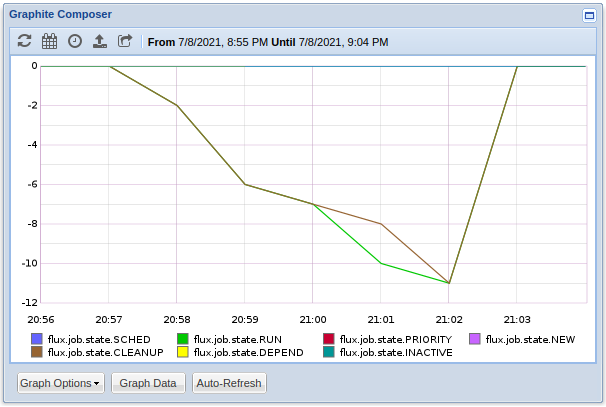
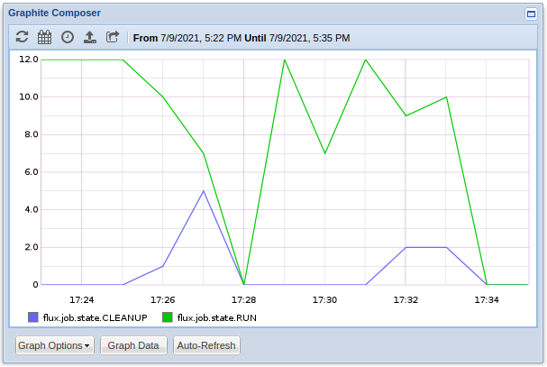
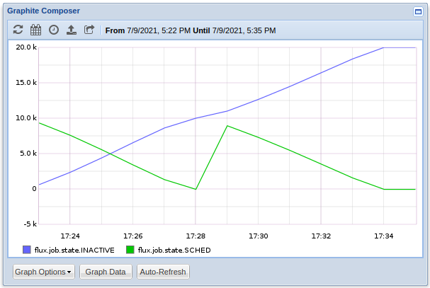
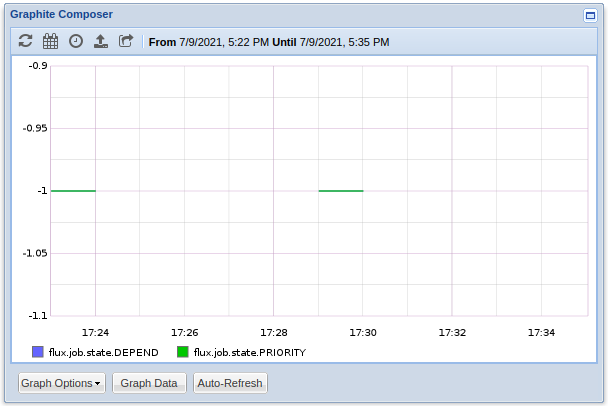
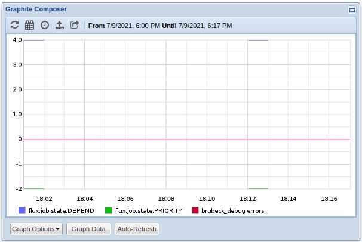

# Week 5: Protoyping

### Adding a Public API Within Flux

So far this summer, the metrics sending code was being directly accessed thru the `fripp.c/h` code which was placed around as needed. It started out as part of the broker (i.e. `src/broker/`) because it was quick to setup and use within the broker which is where the original metrics came from. Then last week, with the introduction of the standalone `state-counts` job-manager plugin, I just included a separate copy of the fripp code when building the plugin. Now is the time when I'm starting to add a more general public-facing api within flux, so I moved the `fripp.c/h` to be part of `libflux` (i.e. `src/common/libflux`). The fripp code is also intended as an internal api, so I created a new pair of files for the public api `stats.c/h` which would make calls to the underlying fripp code. The `stats.h` header defines 5 new functions; three are for individual types (`count`, `gauge`, and `timing`), and `inc` and `dec` are wrappers that allow for the user to not manually keep track of the value over time. For instance, in the `state-counts` plugin, instead of the plugin itself having to keep track of the total counts, it can instead call `inc` and `dec` once per state change callback for the `state` and `prev_state` respectively.

```c
int  flux_stats_inc (flux_t  *h, const  char  *fmt, ...)
	__attribute__ ((format (printf, 2, 3)));
int  flux_stats_dec (flux_t  *h, const  char  *fmt, ...)
	__attribute__ ((format (printf, 2, 3)));  

int  flux_stats_count (flux_t  *h, const  char  *name, size_t  count);
int  flux_stats_gague (flux_t  *h, const  char  *name, size_t  value, bool  inc);
int  flux_stats_timing (flux_t  *h, const  char  *name, double ms);
```

Under the covers `count`, `gauge`, and `timing` are all very similar. They all try to get the `fripp_ctx` from the aux storage current `flux_t` handle, and if it isn't there, they create one and store it. Then they send the metric with `name` and the 3<sup>rd</sup> arg's value as the value to send using the `fripp_format_send`. The `gauge` function has one difference in that it takes a boolean 4<sup>th</sup> argument `inc` to indicate whether or not a positive value should be sent as is or as an increment. This piece is statsd specific and may change in the future, but statsd allows gauges to be sent as increments on the previous value. So `name:+1|g` will add one, **not** set it to 1. Negative values automagically handle this as they have a sign so the inc should be false for negative values.

```c
int  flux_stats_gague (flux_t  *h, const  char  *name, size_t  value, bool  inc)
{
    struct  fripp_ctx  *ctx;
    if (!(ctx  =  flux_aux_get (h, FRIPP_AUX_TAG))) {
	    if (!(ctx  =  fripp_ctx_create (h))) {
		    return  -1;
	    }
	    if (flux_aux_set (h, FRIPP_AUX_TAG, ctx, fripp_ctx_destroy) ==  -1) {
		    return  -1;
	    }
    }
  
    if (inc)
	    return  fripp_format_send (ctx, "%s:+%ld|g", name, value);
    else
	    return  fripp_format_send (ctx, "%s:%ld|g", name, value);
}
```

The `inc` and `dec` functions were inspired by the [statsd-c-client](https://github.com/romanbsd/statsd-c-client), and originally were wrappers around the `counter` function, but that did not seem to be the right fit, so now they wrap around the `gauge` function.

### Refactoring Fripp Code

There were two main changes to the fripp code. The first is that `fripp_ctx` no longer has a `flux_t` handle within it; instead each handle has a `fripp_ctx` stored in its aux storage. The second is that the `fripp_ctx_create` no longer takes a hostname and a port as arguments. Instead they are received via the `FLUX_FRIPP_STATSD` environment variable (for now) which takes the form of `hostname:port`. This was a was to make the `fripp_ctx` more automatic to spin up and allow for endpoint changes on the fly. The current code to get the hostname and port is below, and it should probably have some more error checks added in the future.

```c
char  *uri, *port_s  =  NULL, *host  =  NULL;

if (!(uri  =  getenv ("FLUX_FRIPP_STATSD"))) {
	flux_log_error (h, "FLUX_FRIPP_STATSD not set");
	goto  error;
}
if (!(port_s  =  strrchr (uri, ':'))) {
	flux_log_error (h, "FLUX_FRIPP_STATSD rquires form 'hostname:port'");
	goto  error;
}

host  =  calloc (1, port_s  -  uri  +  1);
strncpy (host, uri, port_s  -  uri);
uint16_t  port  = (uint16_t) atoi (++port_s);
```

I did try using the `libyaurel`'s `yuarel_parse` to parse the string from the environment variable, but it was segfaulting somewhere along being parsed.

### Updating the `state-counts` Plugin

Since the `fripp` and `stats` code are part of `libflux`, building the plugin no longer needs the local copy of `fripp.c/h` when building, and it no longer needs to include `fripp.h` directly as the `stats.h` is part of `flux/core.h`. Also, since the stats api has the `inc` and `dec` functions which send the stats directly, it doesn't need it's timer watcher or any of the individual state counts. After changing everything, the whole plugin is much shorter and looks like this:

```c
#include <flux/core.h>
#include <flux/jobtap.h>

static int state_cb (flux_plugin_t *p,
                      const char *topic,
                      flux_plugin_arg_t *args,
                      void *arg)
{
    flux_job_state_t state;
    flux_job_state_t prev_state = 4096;
    flux_t *h = flux_jobtap_get_flux (p);

    if (flux_plugin_arg_unpack (args, FLUX_PLUGIN_ARG_IN,
                               "{s:i s?i}",
                               "state", &state,
                               "prev_state", &prev_state) < 0) {
        flux_log (h,
                 LOG_ERR,
                 "flux_plugin_arg_unpack: %s",
                 flux_plugin_arg_strerror(args));
        return -1;
    }

    flux_stats_inc (h, "flux.job.state.%s", flux_job_statetostr (state, false));
    flux_stats_dec (h, "flux.job.state.%s", flux_job_statetostr (prev_state, false));

    return 0;
}

int flux_plugin_init(flux_plugin_t *p)
{
    return flux_plugin_add_handler (p, "job.state.*", state_cb, NULL);
}

```

After getting everything setup, I tested the new `stats` api using the updated plugin. As I mentioned earlier, the `inc` and `dec` functions originally were wrappers around the `count` function. I ran 10,000 jobs in a single node instance, and the results don't add up.

**Job States (counters)**



Only the `cleanup` and `run` states were nonzero for the whole period, and they were both completely negative. I'm not sure if counters properly take increments in the same way that gauges do (since it's not noted in the statsd docs), but in this case it isn't the right fit for what we want to see. So, I changed the `inc` and `dec` functions to wrap around the `gauge` function instead, and what showed up is much better and closer to what we got last week by manually keeping track and sending gauges. To test, I ran 20,000 jobs in two batches of 10,000 each back to back.

**Cleanup vs Run**



**Inactive vs Sched**



The one area where the new api may (or may not) be working quite right is with the `depend` and `priority` states. When manually keeping track of each states, both those states were always 0. Now, they are nonzero, but with varying results. Below are two separate instances of 20,000 jobs run in two batches of 10,000. 

**Priority vs Depend 1<sup>st</sup> run**



**Priority vs Depend 2<sup>nd</sup> run**



Since the values were being sent one at a time and right away, it's possible that this variance is due to the flush interval on brubeck to being too short, but I would think that it would show an equilibrium. Meaning if for on flush the `depend` is at a count of `-1` then for either the previous or next flush, it would be `1`. It doesn't appear to be working that way, but perhaps tinkering with the `brubeck` flush interval or having some sort of buffering within the flux handle before sending (as opposed to right away) may help fix it.
