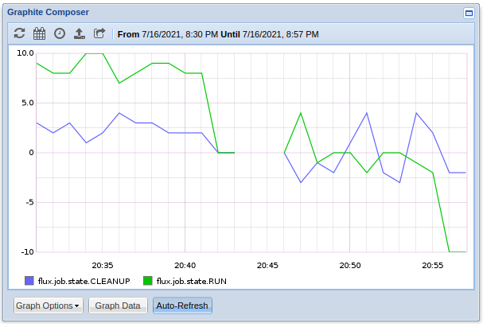
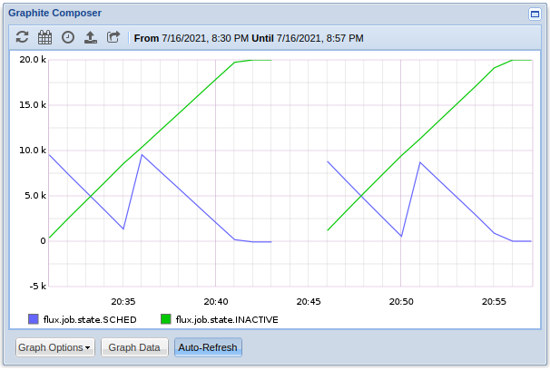

# Week 7: Prototyping

### Adding Internal Aggregation to FRIPP

Last week I added a simple version of the public `stats` api within `libflux` which is basically a wrapper around the internal `fripp` code to handle the actual sending of metrics. The metrics were collected and sent immediately one at a time. However, that method lead to a lot of small individual packets being sent, and could cause a potential slowdown within the handle if lots of places are trying to send a bunch of small packets. One possible solution to this is to have some sort of internal queuing and aggregation within the `fripp_ctx` itself which could periodically flush the queue and send all the stored metrics with something like a `flux_timer_watcher`. The internal aggregation can allow individual `fripp` users to configure some flush interval over which to collect metrics before sending.  This required a few extra things inside of the `fripp_ctx` namely `tail`, `metrics`, `w`, and `period`. The code can be found on the [stats](https://github.com/garrettbslone/flux-core/blob/stats/src/common/libflux/fripp.c) branch of my `flux-core` fork.

```c
typedef  enum {
	BRUBECK_COUNTER,
	BRUBECK_GAUGE,
	BRUBECK_TIMER
} metric_type; 

struct  metric {
	void  *val;
	bool  inc;
	metric_type  type;
};

struct  fripp_ctx {
	struct  sockaddr_in  si_server;
	int  sock;
	int  buf_len;
	int  tail;
	char  *buf;  

	zhashx_t  *metrics;
	flux_watcher_t  *w;
	double  period;
};
```

The `tail` is used to indicate the tail index of the string that has been written to `buf`. `period` is the interval used for the `flux_timer_watcher` `w`. `metrics` is a hash table of `char * -> struct metric *`. The `metric_type` enum is for convenience to help decide how to form each packet. In addition to the changes to `fripp_ctx` and the `metric` struct, `fripp.h` also defined a few new prototypes.

```c
/* Format and append a packet to the internal queue to be sent on the
 * next flush.
 */
int  fripp_packet_appendf (struct  fripp_ctx  *ctx, const  char  *fmt, ...)
		__attribute__ ((format (printf, 2, 3)));

/* Update (or create) and store 'count' for 'name' to be sent on the
 * next flush.
 */
int  fripp_count (struct  fripp_ctx  *ctx, const  char  *name, ssize_t  count);

/* Update (or create) and store 'value' for 'name' to be sent on the
 * next flush. The 'inc' indicates wether or not 'value' is some delta on
 * the previous value. If 'inc' is set and 'name' was not previously stored,
 * then the value is stored directly.
 */
int  fripp_gauge (struct  fripp_ctx  *ctx, const  char  *name, ssize_t  value, bool  inc);

/* Update (or create) and store 'ms' for 'name' to be sent on the
 * next flush.
 */
int  fripp_timing (struct  fripp_ctx  *ctx, const  char  *name, double  ms);

/* Update the internal aggregation period over which metrics accumulate
 * before being set. A 'period' of '0' indicates the metrics should be
 * sent immediately.
 */
void  fripp_set_agg_period (struct  fripp_ctx  *ctx, double  period);
```
___
#### Appending Packets
The `fripp_packet_appendf` function may not need to be in the header file since as of right now it's only used within `fripp.c`, but that may change. It takes a format string for a packet and appends it to the buffer within the `fripp_ctx`.

```c
int  fripp_packet_appendf (struct  fripp_ctx  *ctx, const  char  *fmt, ...)
{
	va_list  ap, cpy;
	va_start (ap, fmt);
	va_copy (cpy, ap); 

	char  buf[128];
	int  len, rc  =  0;  

	if ((len  =  vsnprintf (buf, 128, fmt, ap))
			>=  128) {
		rc  =  -1;
		goto  done;
	} 

	ctx->tail  +=  len;

	if (ctx->tail  >=  ctx->buf_len) {
		char  *tmp;
		if (!(tmp  =  realloc(ctx->buf, (ctx->tail  +  1) *  sizeof (char)))) {
			rc  =  -1;
			goto  done;
		}

		ctx->buf_len  =  ctx->tail  +  1;
		ctx->buf  =  tmp;
	}  

	strcat (ctx->buf, buf);

done:
	va_end (ap);
	va_end (cpy);

	return  rc;
}
```

It is a bit inefficient since it does a `printf` and a `strcat` each time, so it will probably change going forward.

___
### Queuing Metrics

The `fripp_count`, `fripp_gauge`, and `fripp_timing` functions all queue up a metric for either the `count`, `gauge`, and `timer` types respectively, or if the `period` of the `fripp_ctx` is `0`, they send the packet right away. They are all very similar with only small differences, so I'll only show the `fripp_gauge` function here.

```c
int  fripp_gauge (struct  fripp_ctx  *ctx,
		  const  char  *name,
		  ssize_t  value,
		  bool  inc)
{
	if (ctx->period  ==  0)
		return  fripp_sendf (ctx, inc  &&  value  >  0  ? 
				"%s:+%zd|g\n"  :  "%s:%zd|g\n", name, value);

	struct  metric  *m;
	ssize_t  *val;

	if (!(m  =  zhashx_lookup (ctx->metrics, name))) {
		if (!(m  =  calloc (1, sizeof (*m))))
			return  -1;
	}
	if (!(val  =  m->val)) {
		if (!(val  =  malloc (sizeof (*val))))
			return  -1;

		*val  =  0;
	}

	*val  =  inc  ?  *val  +  value  :  value;

	m->type  =  BRUBECK_GAUGE;
	m->inc  =  inc;
	m->val  = (void  *) val; 

	zhashx_update (ctx->metrics, name, (void  *) m);
	flux_watcher_start (ctx->w);

	return  0;
}
```

These three functions all share about 85% of the same code. They all send right away on `0`, get a metric, assign the parameters, store it in the hash table, and start the watcher; because of this, it might make sense to collapse them into a single function. The `gauge` is special in the sense that it takes an increment which affects the previous value instead of just overwriting it like with the `counter` and `timer` types.

___
### Periodic Sends

The `timer_cb` is configured with the watcher in the `fripp_ctx`. If there are no metrics left (the buffer and the hash table are empty) it stops the watcher. Otherwise, it appends each metric to the buffer, sends the buffer, and resets all of the buffers. One thing to note is the destructor `metric_destroy` (which frees the `val` and the `metric` itself) is set for each item during the loop since when I set it at the time of creation, or set a destructor for the list, it was getting called before actually formatting each metric for some reason.

```c
static  void  timer_cb (flux_reactor_t  *r,
			flux_watcher_t  *w,
			int  revents,
			void  *arg)
{
	struct  fripp_ctx  *ctx  =  arg;
	const  char  *name;
	struct  metric  *m; 
	int  rc  =  0; 

	if (!ctx->buf[0] &&  zhashx_size (ctx->metrics) ==  0) {
		flux_watcher_stop (ctx->w);
		return;
	}  

	FOREACH_ZHASHX (ctx->metrics, name, m) {
		switch (m->type) {
			case  BRUBECK_COUNTER: ;
				ssize_t  *c  =  m->val;
				rc  =  fripp_packet_appendf (ctx, "%s:%zd|C\n", name, *c);
				break;
			case  BRUBECK_GAUGE: ;
				ssize_t  *g  =  m->val;
				rc  =  fripp_packet_appendf (ctx,
							     m->inc  &&  *g  >  0  ?
							     "%s:+%zd|g\n"  :  "%s:%zd|g\n",
							     name,
							     *g);
				break;
			case  BRUBECK_TIMER: ;
				double  *d  =  m->val;
				rc  =  fripp_packet_appendf (ctx, "%s:%lf|ms\n", name, *d);
				break;
			default:
				break;
		}

		zhashx_freefn (ctx->metrics, name, metric_destroy);

		if (rc) {
			fprintf (stderr, "fripp timer_cb: %s\n", strerror (errno));
			return;
		}
	}  

	fripp_send_metrics (ctx);
	zhashx_purge (ctx->metrics);
	memset (ctx->buf, 0, ctx->buf_len);

	ctx->tail  =  0;
}
```

---
### Configuring the Aggregation Period

One last thing to add to the api was a way for users to change the aggregation period. This needed a new function in the public `stats` api (`flux_stats_setperiod`) and one within `fripp` (`fripp_set_agg_period`). Now that I think about it I'm not sure why they have different names so that might change going forward. They set a non-negative `period` for the internal watcher and reset it. 

```c
// stats.h
void  flux_stats_setperiod (flux_t  *h, double  period);
```

```c
// fripp.c
void  fripp_set_agg_period (struct  fripp_ctx  *ctx, double  period)
{
	if (period  <  0)
		return;

	ctx->period  =  period;
	double  after  =  flux_watcher_next_wakeup (ctx->w) - (double) time (NULL);

	flux_timer_watcher_reset (ctx->w, after, ctx->period);
}
```

---
### Is it Working?

To test it, I loaded up a single node instance and loaded the `state-counts.so` jobtap plugin. First, I ran 20,000 jobs in two batch of 10,000 using an aggregation period of `0` on the `fripp` watcher (i.e. send every packet right away) to get  a baseline. Then, I reloaded with a `1s` period on the watcher, and ran the 20,000 jobs in batches two batches of 10,000, and it seems to be working kind of. The left sides of each graph was with each metric being sent immediately, and the right side of each graph is with the metrics being aggregated over 1s before being sent.

**Cleanup vs Run**



**Inactive vs Sched**



While I didn't show it here, the `new` state was at the expected -10,000 and then -20,000 for both runs. The `depend` and `priority` states were also at an expected `0` for both runs; The `sched` and `inactive` states are very similar for both runs, and they show a good range showing 20,000 jobs run each. Now, the part with a large difference is the `run` and `cleanup` states. Neither one of them should ever be negative, but for certain intervals, when periodically sending metrics, they both are. Printing the values being sent for the `sched` state, It looked like none were being lost (a net 0) were sent, but it may take some more fine tuning to see exactly what combinations of intervals within `flux`, `brubeck`, and `graphite` give the best results.
