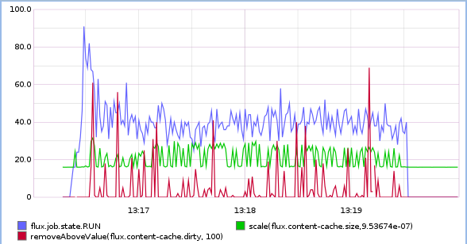

# Week 8: Prototyping

### Adjusting the Granularity of Graphite

By default Graphite (or really it's aggregator carbon) aggregates data over 1 minute intervals before plotting, so it plots 1 point per minute. Many of the metrics we are gathering from within `flux` could use a more fine-grained resolution like maybe one per second instead of one per 60 seconds. Back in [Week 5](./week5.md), I tried to change the intervals over which Graphite would plot, but I wasn't able to see really any difference. The reason why it didn't work back then is that I was using the old config location of `/opt/graphite/conf/storage-schemas.conf` In order to setup a custom flush interval for Graphite you have to:

1. Enable the carbon cache
	```bash
	$ sudo vim /etc/default/graphite-carbon
	$ CARBON_CACHE_ENABLED=true
	```
2. Editing the config file
	```bash
	$ sudo vim /etc/carbon/storage-schemas.conf
		# comment out this default
		#[default_1min_for_1day]
		#pattern = .*
		#retentions = 60s:1d

		# store all flux metrics as 1s pieces of data
		[flux]
		pattern = ^flux*
		retentions = 1s:4d
	```
3. Restart carbon
	```bash
	$ sudo systemctl restart carbon-cache
	```

Here is a graph of the content-cache's size (MB), it's dirty entries, and the number of running jobs. This was 10,000 jobs run in an instance of size 8. Which provides a much different insight than seeing one point per minute with many more jumps up and down instead of a smooth line.




### Updating Fripp

There were some small changes I made to the the `fripp` code in `libflux`. First, to avoid the overhead of having each metric have a separately allocated `void *`, I changed each one to use a `union` of an `ssize_t` and `double`. Also, since it is fairly expensive to just destroy the entire hash table of metrics every time they are sent, I added a second `union` to the `metric` struct to hold the previous value as well. So now when the metric value is the same as the previous value, it stops being sent.

```c
union  val {
	ssize_t  l;
	double  d;
};

  
struct  metric {
	union  val  cur;
	union  val  prev;
	bool  inc;
	bool  tombstone;
	metric_type  type;
};
```

Since it isn't safe to modify the `zhashx_t` while iterating thru it and the entire table is no longer being cleared all at once, the way I handled deleting metrics was to add a `zlist_t` to the `fripp_ctx` to be hold the names of the metrics to be deleted. And I was still getting weird errors of the destructor function being called during table iteration when it was set globally using `zhashx_set_destructor`. Nevertheless, if a metric hadn't been updated since the last flush, it was appended to the list, after the packet was sent, the lest was cleared and all entries deleted from the table.

```c
	char n[INTERNAL_BUFFSIZE];
	
	FOREACH_ZHASHX (ctx->metrics, name, m) {
		if (m->cur.d  ==  m->prev.d) {
			zlist_append (ctx->done, (void  *) strcpy(n, name));
			continue;
		}

		...
	}
	
	char  *s;
	while ((s =  zlist_pop (ctx->done))) {
		// set the free function here to avoid it being called 
		// early
		zhashx_freefn (ctx->metrics, s, metric_destroy);
		zhashx_delete (ctx->metrics, s);
	}
```

The last major change I made was regarding the increment use of the gauge type. Brubeck (and statsd) can take gauge types as arbitrary values (i.e. `foo.bar:123|g`), or they can take increments which increment the previously stored value (starting at `0`) (i.e. `foo.bar:+123|g` or `foo.bar:-123|g`). Originally the `flux_stats_inc/dec` functions sent an incremented gauge to brubeck, but it resulted in some weirdness if the value was constantly being incremented in opposite directions, like the `RUN` state having fully negative values for example. So, I thought maybe that implementing the increment internally, and just sending each one as a gauge might work better, and it does seem to work better giving results very similar to sending the metrics right away each time.

**Cleanup vs Run**


### Summer Slam

Mostly this week I was working on my Summer Slam presentation, but unfortunately it hasn't been approved for open release yet, so hopefully in a week or two I'll be able to put the slides somewhere in here.


